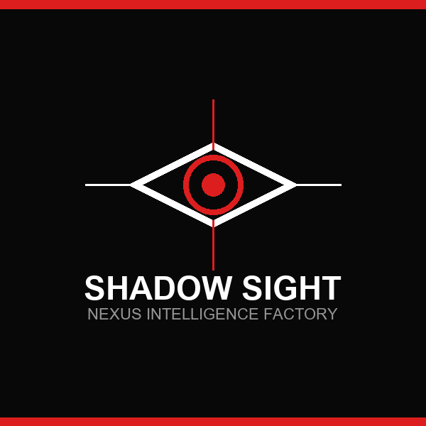

# SHADOW SIGHT 👁️
**NEXUS INTELLIGENCE SYSTEM**

## Overview
Shadow Sight is an autonomous multi-layer intelligence pipeline designed to ingest, classify, and extract structured OSINT findings without human intervention. This repository contains the core OSINT analysis logic and database extraction engines compiled by the NEXUS factory.

## Live Deployment 🚀
**[View Production Web Interface (Vercel)](https://landing-lom39on07-agent-8947s-projects.vercel.app)**

## Architecture
- **`src/core/`**: Orchestrates external OSINT API queries and core analysis scripts.
- **`src/database/`**: Handles persistent storage, Graph relationships, and Postgres ingestors.
- **`landing/`**: Real-time dynamically generated web application (deployed via Vercel).
- **`presentation.pdf`**: Downloadable system briefing.

## About the Engine
This repository is autonomously generated and updated by **Agent 14** (Architect) and **Agent 15** (WIKI_DEPLOYER) running inside the NEXUS Autonomous Intelligence Factory. All deployments, commits, and UI designs are machine-authored.
